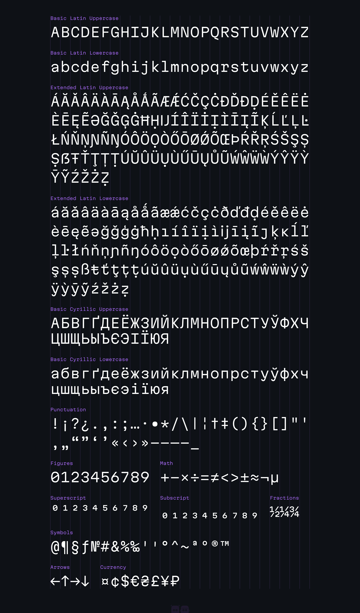
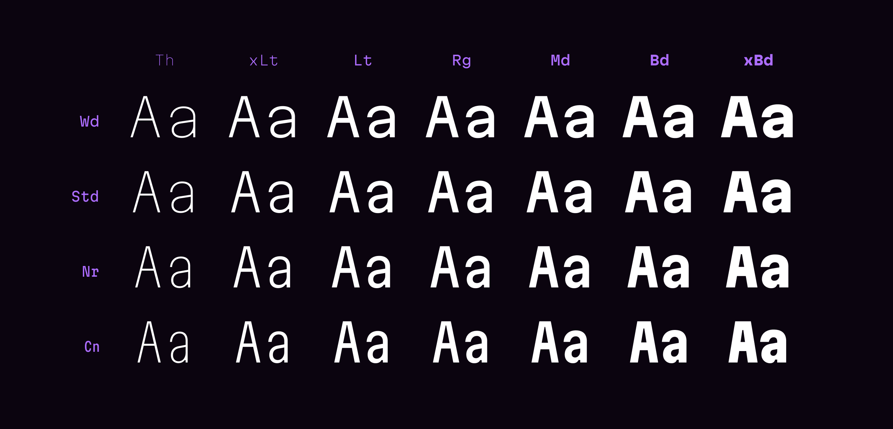
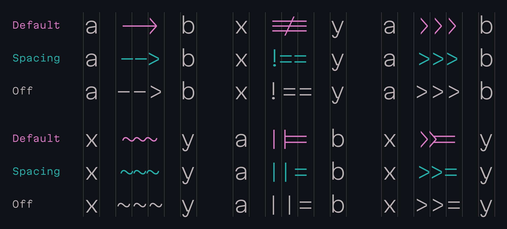
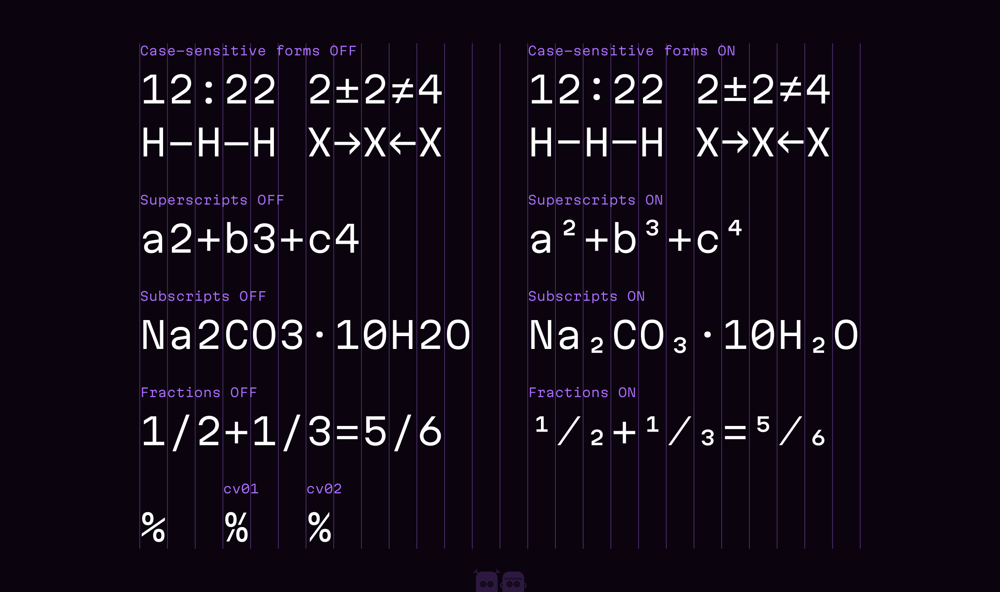
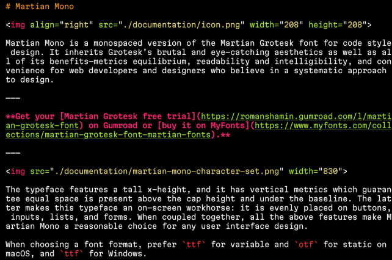
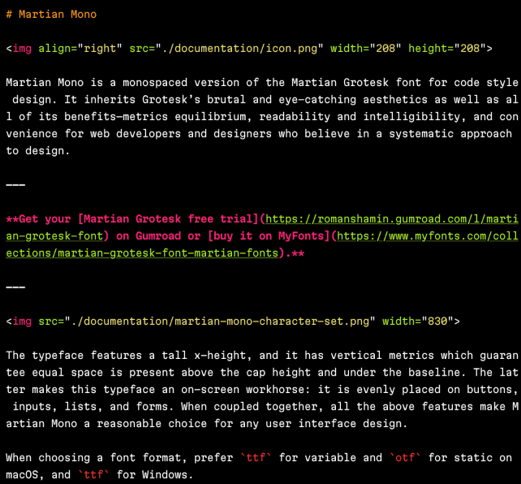

# Martian Mono

Martian Mono is a monospaced version of the Martian Grotesk font for code style design. It inherits Grotesk’s brutal and eye-catching aesthetics as well as all of its benefits—metrics equilibrium, readability and intelligibility, and convenience for web developers and designers who believe in a systematic approach to design.

👉 **Get your [Martian Grotesk free trial](https://romanshamin.gumroad.com/l/martian-grotesk-font) on Gumroad or [buy it on MyFonts](https://www.myfonts.com/collections/martian-grotesk-font-martian-fonts) to support Mono development.**



The typeface features a tall x-height, and it has vertical metrics which guarantee equal space is present above the cap height and under the baseline. The latter makes this typeface an on-screen workhorse: it is evenly placed on buttons, inputs, lists, and forms. When coupled together, all the above features make Martian Mono a reasonable choice for any user interface design.

When choosing a font format, prefer `ttf` for variable and `otf` for static on macOS, and `ttf` for Windows.

## Download

Download the latest package from the [releases page](https://github.com/evilmartians/mono/releases) or embed the font from [Google Fonts](https://fonts.google.com/specimen/Martian+Mono).

## Styles

Martian Mono consists of a variable font and 28 styles: Condensed to Semi Wide, Thin to Extra Bold.



The font has 4 styles on the width axis:

| Short name | Full name | CSS percentage | CSS keyword |
| --- | --- | ---: | --- |
| sWd | Semi Wide | 112.5% | semi-expanded |
| Std | Standard | 100% | normal |
| Nr | Narrow | 87.5% | semi-condensed |
| Cn | Condensed | 75% | condensed |

And 7 weights:

| Short name | Full name | CSS numeric | CSS keyword |
| --- | --- | ---: | --- |
| Th | Thin | 100 |  |
| xLt | Extra Light | 200 |  |
| Lt | Light | 300 |  |
| Rg | Regular | 400 | normal |
| Md | Medium | 500 |  |
| Bd | Bold | 700 | bold |
| xBd | Extra Bold | 800 |  |

## Coding ligatures

Martian Mono offers two sets of coding ligatures. The default set transforms sequences like `-->` into a standard arrow for a cleaner look. For those who prefer unaltered symbols, the second set features spacing ligatures—where `-->` remains two hyphens and a greater-than sign, with subtle spacing and vertical alignment tweaks for improved readability.

Regular ligatures are enabled by default. To switch to spacing ligatures, activate the Stylistic Set #03 OpenType feature.



## OpenType features



## Font size and legibility

Originally designed for the screen, the glyph heights stick to the pixel grid on commonly used font sizes. In addition, it comes equipped with OpenType and TrueType hinting, and Martian Mono appears legible on most platforms, even when being rendered in small sizes.

For the best results, use the following pairs of size / line height:

* 7.5 / 10 (or 14, 18, etc.) px
* 10 / 12 (or 16, 20, etc.) px
* 12.5 / 14 (or 18, 22, etc.) px
* 15 / 20 (or 24, 28, etc.) px

## Usage

_You are welcome to add more hints on usage (especially on the desktop) via pull requests._

### On the Web

Download the `woff2` package from the [releases page](https://github.com/evilmartians/mono/releases) to get the variable font in WOFF2 format ([see WOFF2 support matrix between browsers](https://caniuse.com/woff2)).

Consult the following articles from Evil Martians' blog on how to use variable fonts:

* [Variable fonts in real life: how to use and love them](https://evilmartians.com/chronicles/variable-fonts-in-real-life-how-to-use-and-love-them)
* [The joy of Variable Fonts: getting started on the Frontend](https://evilmartians.com/chronicles/the-joy-of-variable-fonts-getting-started-on-the-frontend)

### On the Desktop: choosing a variant

For better compatibility with various terminal emulators and text editors on the desktop, it is a good idea to install the font not as a single variable font but as several different fonts.

- Manually
  - See the [releases page](https://github.com/evilmartians/mono/releases), and download `otf` or `ttf` files.
  - Install the fonts.
- Windows
  - See the [releases page](https://github.com/evilmartians/mono/releases), and download `ttf` files.
  - Install the fonts.
- macOS
  - See the [releases page](https://github.com/evilmartians/mono/releases), and download `otf`. Install the fonts.
  - Or, use [Homebrew](http://brew.sh/):
    ```shell
    brew install --cask font-martian-mono
    ```

Next, if your application has a font picker, just choose _Martian Mono_ and the variant you require.

If the configuration is done using a text file, use `Martian Mono` for the default font variant (_Martian Mono Std Rg_), or try specifying the font name like `MartianMono-NrRg` for the _Nr Rg_ variant.

#### Choosing a variant for a dark background

When choosing a font variant for a darker (or pitch black) background for your terminal or text editor, consider choosing a "lighter" variant if the font looks "too bold" to you. White font on a dark background can have that effect, [see here for details](https://evilmartians.com/chronicles/variable-fonts-in-real-life-how-to-use-and-love-them#variable-fonts-in-practice).

For example, go for _Std Lt_ instead of _Std Rg_.

### On the Desktop: line spacing

Once you install the font and start using it, you might notice that the picture might look quite confined:



Instead, you might want to opt for something more readable and easy for the eyes if you like:



The difference is _line spacing_. Learn how to set it up below, and consult the _Font size and legibility_ chapter to learn about the best setting. Or, experiment yourself by setting different percentages (`120%`, `140%`) or paddings in pixels (`1`, `2`, `4`, and so on).

#### Terminal emulators

##### Terminal (macOS)

Preferences → Profiles → (choose a profile) → Text → Font → [Change]. You will be met with a font picker dialog that has the _Line Spacing_ property.

##### iTerm 2 (macOS)

Preferences → Profiles → (choose a profile) → Text. Look for the `n/n` symbol that looks like a fraction. That's your line spacing, in percentage (100% is the default).

##### Ghostty

Open or create a configuration file at `~/.config/ghostty/config`. Try the following settings (be sure to set the font size you like):

```
font-family = "Martian Mono"
font-size = 14
adjust-cell-height = 20%
```

Relaunch the terminal, or reload the configuration with `cmd+shift+,` (macOS) or `ctrl+shift+,` (Linux).

Consult the official documentation on font rendering and options here: https://ghostty.org/docs/config

##### kitty

Open the config file (`~/.config/kitty/kitty.conf`). Look for the `adjust_line_height` property and see the documentation.

#### Text editors

##### VS Code

To specify values for variable axes, use `editor.fontVariations`:

```jsonc
// settings.json
{
    "editor.fontFamily": "Martian Mono",
    "editor.fontVariations": "'wdth' 87.5, 'wght' 450",
}
```

Consider switching font aliasing method to `auto` for improved rendering on displays with high DPI:

```jsonc
// settings.json
{
    "workbench.fontAliasing": "auto",
}
```

Finally, fine tune line height (`editor.lineHeight`):

```jsonc
// settings.json
{
    "editor.fontFamily": "Martian Mono",
    "editor.fontSize": 12.5,
    "editor.lineHeight": 20,
}
```

##### vim

For setting line spacing in GUI versions of vim, see [`linespace`/`lsp`](https://vimhelp.org/options.txt.html#%27linespace%27).

##### Sublime Text

Open your preferences. Add the `line_padding_top` and `line_padding_bottom` parameters. Both set the padding for a line of text in pixels.

## Roadmap

* Cyrillic script for Bulgarian, Serbian, and Macedonian (work in progress)
* Powerline symbols (not sure)
* Italics (not sure)
