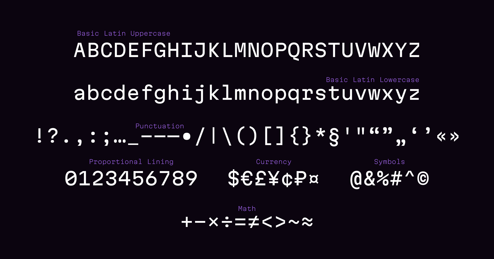

# Martian Mono

Martian Mono is a monospaced typeface family consisting of a variable font and 28 styles: Condensed to Wide, Thin to Extra Bold. It’s not a neutral font, but despite this, it remains suitable for reading. Overhanging terminals, a closed aperture, and an almost complete lack of contrast lead to slightly brutal and assertive aesthetics.

The typeface features a tall x-height, and it has vertical metrics which guarantee equal space is present above the cap height and under the baseline. The latter makes this typeface an on-screen workhorse: it is evenly placed on buttons, inputs, lists, and forms. When coupled together, all the above features make Martian Mono a reasonable choice for any user interface design.

This version of Martian Mono contains only basic Latin, figures, punctuation, and essential symbols. Ligatures for code, italics, and other languages support is in progress.

Prefer otf file format for macOS, and ttf for Windows.

## Download

Download the latest package from the [releases page](https://github.com/evilmartians/mono/releases).

## Styles

The font has 4 styles on the width axis:

| Short name | Full name |
| ---------- | --------- |
| Wd | Wide |
| Std | Standard |
| Nr | Narrow |
| Cn | Condensed |

And 7 weights:

| Short name | Full name |
| ---------- | --------- |
| Th | Thin |
| xLt | Extra Light |
| Lt | Light |
| Rg | Regular |
| Md | Medium |
| Bd | Bold |
| xBd | Extra Bold |

## Font size and legibility

Originally designed for the screen, the glyph height stick to the pixel grid on commonly used font sizes. In addition, it comes equipped with OpenType and TrueType hinting, and Martian Mono appears legible on most platforms, even when being rendered in small sizes.

For the best results use next pairs of size / line height:

7.5 / 10 (or 14, 18) px
10 / 12 (or 16, 20) px
12.5 / 14 (or 18, 22) px
15 / 20 (or 24, 28) px
etc.

## Support

If you want to support Martian Mono, spread the word on social media or consider [becoming a patron](https://www.patreon.com/romanshamin).

I’m sincerely grateful for any support!